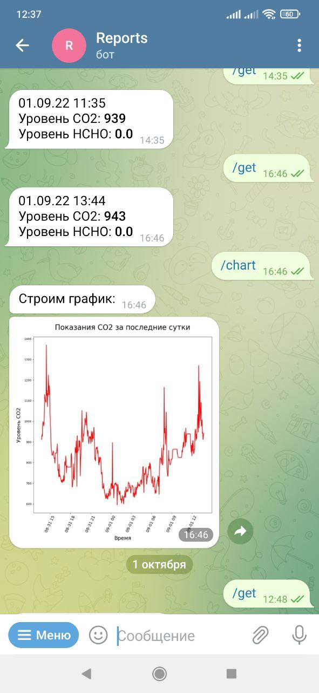
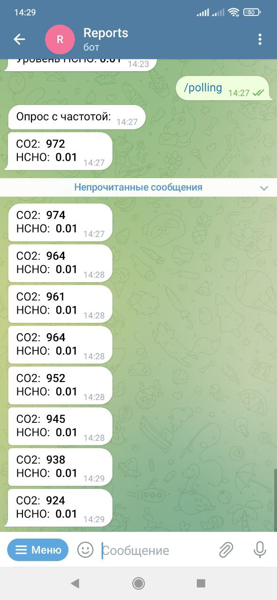

<h2>Описание</h2>
(Мой первый мини-проект на питоне) 
Анализатор качества воздуха с управлением через телеграм. 
Датчик углекислого газа z19, датчик формальдегида ZE08-CH2O, контроллер - D1 MINI PRO (ESP8266), 
прошивка Arduino (что мне знакомо), и серверное приложение 
с базой Sqlite, пишу на Python. 
Котроллер подключается к домашней, 
отдельно выделенной WiFi сети, плюс дополнительно есть возможность 
подключить к точке доступа моего смартфона, чтоб делать замеры вне дома. 
И раз в три или десять минут (зашивается в контроллер константой) соединяется с сервером.
Если от телеграма нет запроса на оперативный мониторинг, 
то данные записываются в базу. Если есть запрос на оперативный мониторинг, 
то контроллер на протяжении трех минут будет слать данные с выбранным интервалом (раз в 10, 20 или 30 секунд), 
а приложение будет их напрямую пересылать в чат телеграм. 
В чат-бот заложил следующий функционал: 
 
<ul>
<li>Получить текущие показания. Показывает последние показания датчиков из базы.</li>
<li>Включить опрос. Включает оперативный мониторинг состояния датчиков.</li>
<li>Построить график. Присылает показания датчиков за выбранный временной интервал.</li>
<li>Настроить алерт. Включить оповещение при превышении допустимного значения уровня СО2 или формальдегида. </li>
</ul> 
Файлы: 
<ul>
<li><b>main.py</b> - головной модуль</li>
<li><b>telega.py</b> - функционал работы с телеграм</li>
<li><b>alert.py</b> - модуль для работы оповещения</li>
<li><b>serv.py</b> - модуль для работы серверной части</li>
<li><b>chart.py</b> - модуль для работы с базой</li>
<li><b>client_test.py</b> - скрипт клиента (только для тестирования сервера) </li>
<li><b>WiFiClient_climate.ino</b> - код прошики для контроллера </li>
</ul>
 

В файле <b>config/conf.ini</b> содержатся параметры подключения. Для создания базы с таблицами, необходимо запустить скрипт chart.py с первым параметром '-cr', а вторым - именем базы как оно задано в conf.ini
 
 
(Уже сильно позднее, разбираясь с Docker, сделал образ и запускаю теперь из контейнера) 
  
Скриншоты работы: 
<table border="0">
<tr><td>

</td>
<td>

</td>
</tr>
</table>
